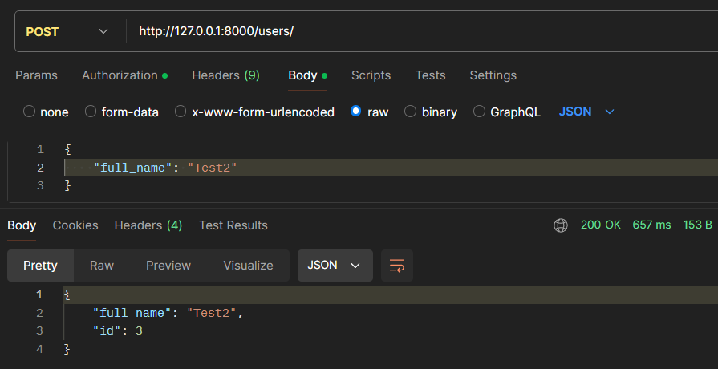
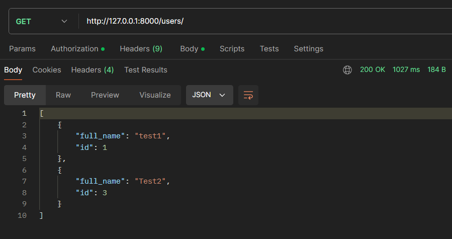
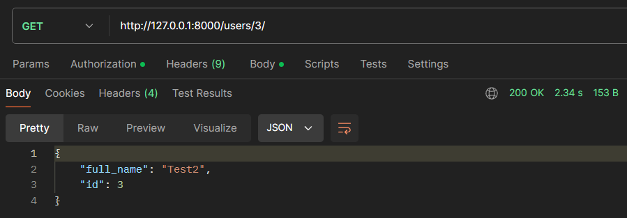
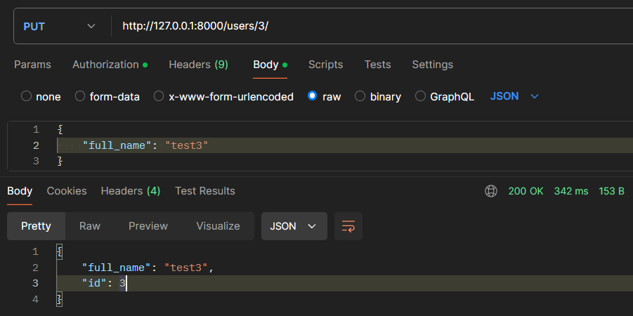
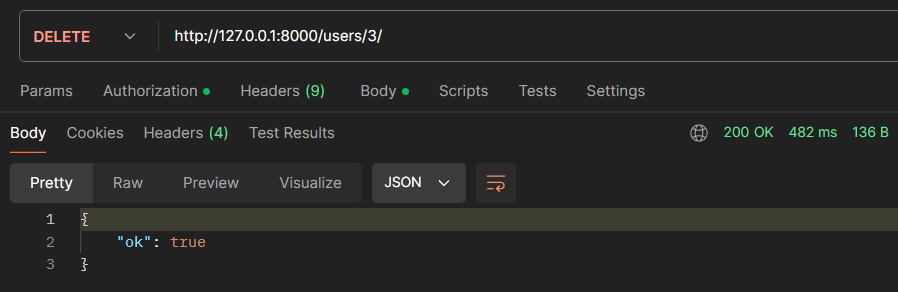

# REST API сервис для управления пользователями

## Описание

Этот проект представляет собой REST API сервис, реализующий операции над сущностью User с полями - id и ФИО. Сервис включает следующие возможности:
- Создание пользователя
- Изменение пользователя
- Получение пользователя по id
- Удаление пользователя

## Технические требования

- Несколько реализаций репозитория - с использованием Редис или БД (MySQL, PostgreSQL или другие). 
- Реализация репозитория выбирается при инициализации приложения из конфигурационного файла, с указанием типа репозитория и его настройками.
- Использование ООП.

## Установка

### Клонирование репозитория

```
git clone https://github.com/samwance/UserManagerFastapi.git
```

### Создание и активация виртуального окружения
```
python -m venv venv
source venv/bin/activate  # Для Windows используйте `venv\Scripts\activate`
```
### Установка зависимостей

```
pip install -r requirements.txt
```

## Настройка
### Конфигурация репозитория
Создайте файл .env и скопируйте дынные из .env.sample

Для выбора типа репозитория, необходимо установить переменную окружения REPOSITORY_TYPE. Доступны два варианта:

redis - использование репозитория с редисом
orm - использование ORM репозитория (по умолчанию используется SQLite, но можно изменить на другую СУБД в настройках Django)

### Запуск сервера разработки
```
uvicorn app.main:app --reload
```
## Использование
### Эндпоинты API
- GET /users/ - Получение списка всех пользователей
- POST /users/ - Создание нового пользователя
- GET /users/\<id>/ - Получение пользователя по id
- PUT /users/\<id>/ - Обновление данных пользователя
- DELETE /users/\<id>/ - Удаление пользователя
## Примеры запросов и ответов по эндпоитам
### Создание пользователя
```
POST /users/
Content-Type: application/json

{
    "full_name": "Иван Иванов"
}
```

### Получение списка пользователей
```
GET /users/
```

### Получение пользователя
```
GET /users/1/
```

### Обновление данных по пользователю
```
PUT /users/1/
Content-Type: application/json

{
    "full_name": "Петр Петров"
}
```

### Удаление пользователя
```
DELETE /users/1/
```
